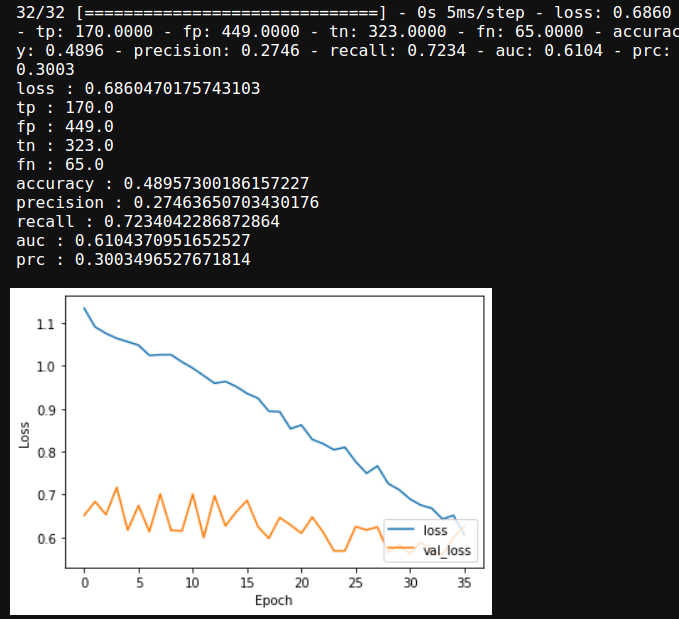

## Dependencies

biopython==1.78 
keras==2.4.3 
numpy==1.19.1 
pandas==1.1.3 
scipy==1.5.2 
tensorflow==2.2.0 
matplotlib-base==3.2.2 

## Starting Point
Go to https://alphafold.ebi.ac.uk/download and download the *Saccharomyces cerevisiae* dataset (about 1GB) and place the contents (there are about 6,000 .pdb files) under raw_data/alphafold_structures

Run all notebooks sequentially in their numerical order from 1 to 5 (number 4 takes a while) :)

## Introduction
In this project, we attempt to predict gene essentiality in *Saccharomyces cerevisiae* (budding yeast) using structural data from AlphaFold (we admit that using experimentally verified structural data from the PDB would have resulted in a better classifier, but we tried their API and there were a lot of errors). We input the processed data into a CNN and report our results.

## Materials and Methods

We collect the structural files from AlphaFold (https://alphafold.ebi.ac.uk/download). In addition, we collect esential gene data for yeast from the DEG as well as all coding sequences from Ensembl. We subtract the essential genes from all coding sequences to generate the non-essential dataset. Also, due to naming convention differences between the dataset from DEG/Ensembl and AlphaFold, we downloaded the entire coding sequence genome from Uniprot and cross-referenced the names that way (raw_data/yeast_uniprot_proteins.fasta).

Following the paper "Prediction of protein function using a deep convolutional neural network ensemble" by Zacharaki [1], We format the structural data to psi and phi angles using a biopython function. Then, we create contact maps from these angles (using pre-defined bin sizes, 19x19, and 23 channels, 1 for every amino acid plus UNK for Unknown).

We feed these contact maps into a simple convolutional neural network (CNN) and receive as output a binary classification where 1 represents essential and 0 means non-essential. We plot the loss and report the final metrics in the 5_cnn.ipynb notebook. The results are not great, but the CNN performs better than a random classifier.

## Results
We train on 4028 total examples. 855 positive (essential) examples, 3173 negative (non-essential) examples.  
We testing on 1007 total examples. 235 positive examples (essential), 772 negative (non-essential) examples.

We achieve an AU-ROC of 0.61 and an AU-PRC of 0.30. We speculate the results can be improved by tuning the hyperparameters of the CNN via grid-search.

## References and Acknowledgements
[1] Zacharaki EI. 2017. Prediction of protein function using a deep convolutional neural network ensemble. *PeerJ Computer Science* 3:e124 https://doi.org/10.7717/peerj-cs.124

Special thanks for professor LePendu for a fun and educational class.
